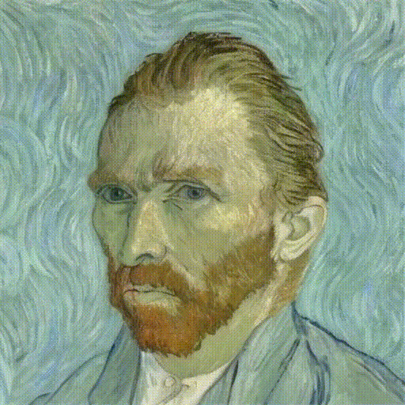
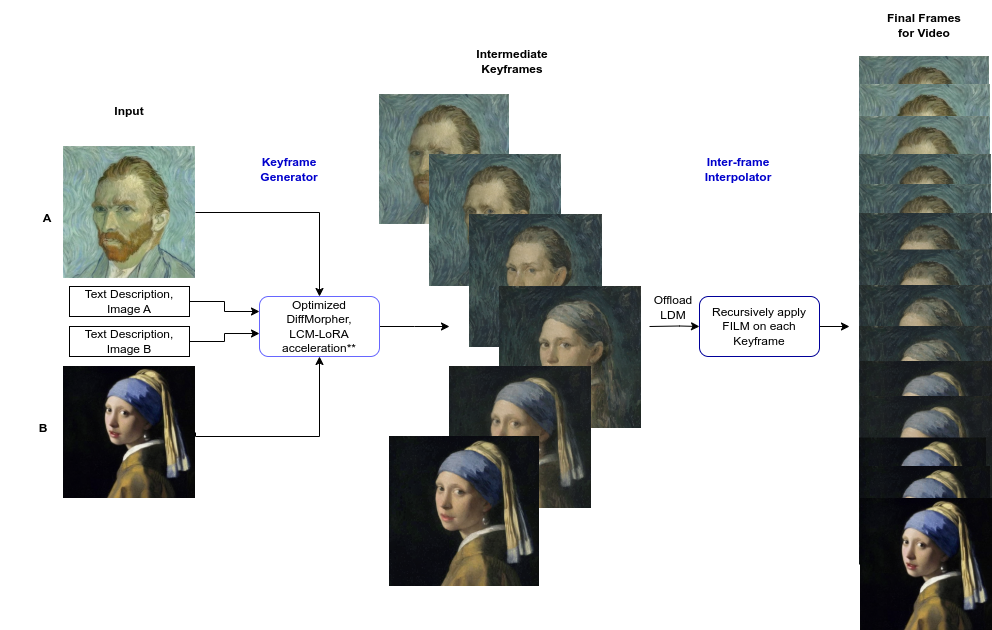
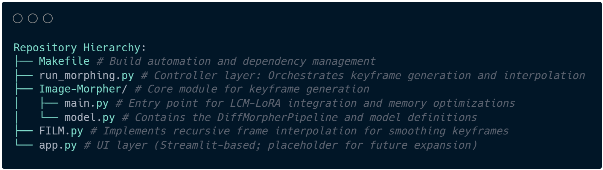
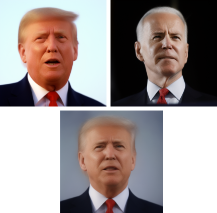
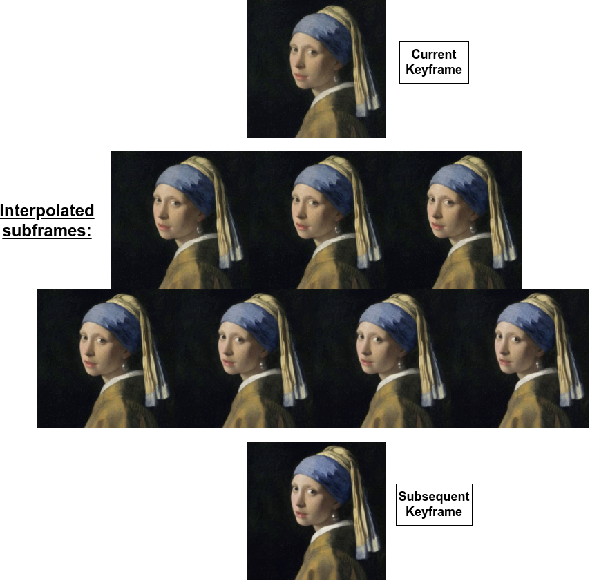

# Metamorph: Advanced Image Morphing Pipeline

<div align="center">
   
   <br>
   <br>
   
   [](https://www.python.org/downloads/release/python-3129/)
   [](https://nalin0503.github.io/FYP_ImageMorpher/)
   [](https://huggingface.co/spaces/nalin0503/metamorph)
   [](https://opensource.org/licenses/MIT)
   
   <p align="center">
  <i>
    NTU Final Year Project on Advanced Image Morphing via Diffusion Models with Frame Interpolation for Large Motion (FILM)<br>
    Presentation slides link:  
    <a href="https://tinyurl.com/FYPImageMorphing">tinyurl.com/FYPImageMorphing</a>
  </i>
   </p>
   
   
</div>

## 🌟 Overview

Metamorph is a state-of-the-art image morphing framework that combines diffusion-based generative models with frame interpolation techniques to create smooth, high-quality transitions between images. The system integrates:

- **DiffMorpher**: Creates keyframe sequences using latent space interpolation in diffusion models
- **LCM-LoRA**: Accelerates the reverse diffusion process, nearly lossless quality
- **FILM**: Performs advanced frame interpolation for ultra-smooth transitions
- **Web Interface**: User-friendly Streamlit application for easy morphing

<div align="center">
   
</div>

## 📁 Repository Structure

<div align="center">
   
</div>

- **Makefile**: Build automation and dependency management
- **run_morphing.py**: Controller layer that orchestrates keyframe generation and interpolation
- **DiffMorpher/**: Submodule utilized for keyframe generation
  - **main.py**: Entry point for LCM-LoRA integration and memory optimizations
- **FILM.py**: Implements recursive frame interpolation for smoothing keyframes
- **app.py**: UI layer (Streamlit) for interactive morphing

## ✨ Features

- **High-Quality Morphing**: Generate seamless transitions between any two images
- **Model Selection**: Choose from multiple diffusion models for different aesthetic results
- **Acceleration Options**: Toggle LCM-LoRA to significantly reduce processing time
- **Advanced Interpolation**: Apply recursive FILM processing for smoother results
- **Text Guidance**: Optional text prompts to guide the semantic transition (retained from [DiffMorpher](https://github.com/Kevin-thu/DiffMorpher))
- **Improved Keyframes**: Enhanced with AdaIN and rescheduled sampling for better coherence (retained from [DiffMorpher](https://github.com/Kevin-thu/DiffMorpher))
- **User-Friendly Interface**: Simple web application to control all parameters

## 🛠️ Installation

### Prerequisites

- Python 3.12
- NVIDIA GPU with CUDA support
- Git

### FILM Dependencies

As recommended by [FILM](https://github.com/google-research/frame-interpolation):
- CUDA Toolkit 11.2.1
- cuDNN 8.1.0

You may install the relevant libraries at [CUDA and cuDNN official downloads](https://developer.nvidia.com/cuda-zone "NVIDIA Developer Zone").

> **Note**: If you encounter dependency conflicts during runs, you may try: `conda install -c conda-forge cudatoolkit=11.8.0 cudnn=9.3.0`

### Setup Instructions

1. Clone the repository:
   ```bash
   git clone https://github.com/nalin0503/FYP_ImageMorpher.git
   cd FYP_ImageMorpher
   ```

2. Initialize and update submodules:
   ```bash
   make init
   ```
   
   This will:
   - Initialize the DiffMorpher submodule
   - Synchronize submodule URLs
   - Update submodules to the latest commits
   - Install required Python packages

3. Install CUDA and cuDNN:  
   Ensure the required CUDA Toolkit and cuDNN versions are installed on your system (revisit the [FILM Dependencies](#film-dependencies) section above for details).

## 🚀 Usage

### Option 1: Web Interface (Recommended)

Run the Streamlit application:
```bash
streamlit run app.py
```

For NTU SLAB GPU cluster users, select the "Using SLAB GPU Cluster" option in the interface.

### Option 2: Direct CLI Command

Use `run_morphing.py` as the overall orchestration script:
```bash
python run_morphing.py \
  --image_path_0 DiffMorpher/assets/Trump.jpg \
  --prompt_0 "A photo of an American man" \
  --image_path_1 DiffMorpher/assets/Biden.jpg \
  --prompt_1 "A photo of an American man" \
  --output_path /results/Trump_Biden \
  --use_adain \
  --use_reschedule \
  --save_inter \
  --num_frames 16 \
  --duration 100 \
  --use_film \
  --film_output_folder "FILM_Results"
  --film_fps 30 \
  --film_num_recursions 4
```

### Option 3: Using Makefile

```bash
make morph
```

### Option 4: DiffMorpher Only (Without FILM)

Use the base DiffMorpher for keyframe generation only:
```bash
cd DiffMorpher
python main.py \
  --image_path_0 /assets/Trump.jpg \
  --image_path_1 /assets/Biden.jpg \
  --prompt_0 "A photo of an American man" \
  --prompt_1 "A photo of an American man" \
  --output_path "/results/Trump_Biden" \
  --use_adain \
  --use_reschedule \
  --save_inter \
#   --use_lcm
```

For NTU SLAB GPU cluster users:
```bash
cd DiffMorpher
srun -p rtx3090_slab -w slabgpu05 --gres=gpu:1 \
  --job-name=test --kill-on-bad-exit=1 python main.py \
  --image_path_0 /assets/Trump.jpg \
  --image_path_1 /assets/Biden.jpg \
  --prompt_0 "A photo of an American man" \
  --prompt_1 "A photo of an American man" \
  --output_path "/results/Trump_Biden" \
  --use_adain \
  --use_reschedule \
  --save_inter \
  --use_lcm
```

## 📊 Key Components

### LCM-LoRA Acceleration

DiffMorpher optionally leverages latent consistency models to create intermediate keyframes between source images. LCM-LoRA is a set of weights applied on top of the Latent Diffusion Model utilized to accelerate generation by reducing sampling steps required, while being almost lossless.

<div align="center">
   
</div>

### FILM Interpolation

Frame Interpolation for Large Motion (FILM) is particularly effective at handling large displacements between frames:

- **Recursive Application**: Create exponentially more intermediate frames with each pass
- **Smooth Motion**: Handle large changes between frames that traditional interpolation struggles with
- **Detail Preservation**: Maintain fine details during the interpolation process

<div align="center">
   
</div>

## 📖 Documentation

For detailed parameter explanations and usage guidelines, visit our [GitHub Pages documentation](https://nalin0503.github.io/FYP_ImageMorpher/).

## 🔗 Links

- [DiffMorpher Submodule](https://github.com/nalin0503/DiffMorpher)
- [Hugging Face Demo](https://huggingface.co/spaces/nalin0503/metamorph)
- [FILM Repository](https://github.com/google-research/frame-interpolation)
- [Original DiffMorpher](https://github.com/Kevin-thu/DiffMorpher)

## 📋 Citation

If you use Metamorph in your research, please cite our work:

```bibtex
@misc{author2025metamorph,
  title={Metamorph: Enhancing Image Morphing with Diffusion Models and Frame Interpolation},
  author={Sharma, Nalin},
  year={2025},
  howpublished={Nanyang Technological University, Final Year Project}
}
```

## 📜 License

This project is licensed under the MIT License - see the [LICENSE](LICENSE) file for details.

## 🙏 Acknowledgements

- [DiffMorpher](https://github.com/Kevin-thu/DiffMorpher) for the base implementation
- [Stable Diffusion](https://github.com/CompVis/stable-diffusion) for the foundation models
- [Google Research FILM](https://github.com/google-research/frame-interpolation) for the interpolation framework
- [Latent Consistency Models](https://github.com/lucidrains/latent-consistency-model) for acceleration techniques
- Nanyang Technological University, College of Computing and Data Science (NTU CCDS) for supporting this research.
